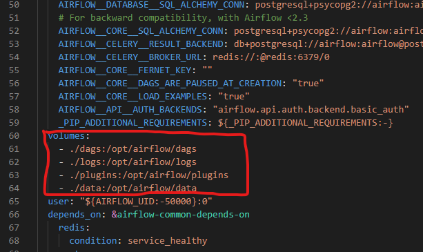

<h1 align="center">
  Weather-ETL-Airflow
</h1>

Weather ETL with Apache Airflow scheduler
 

## How to Run

- getting started with download Docker Dekstop for windows here [Docer dekstop](https://desktop.docker.com/win/main/amd64/Docker%20Desktop%20Installer.exe)
- after download and install the docker dekstop, download [WSL 2 backend](https://wslstorestorage.blob.core.windows.net/wslblob/wsl_update_x64.msi)
- follow full docker installation [here](https://docs.docker.com/desktop/install/windows-install/) until docker can be running
- then, follow airflow setup for make a new container [here](https://airflow.apache.org/docs/apache-airflow/stable/howto/docker-compose/index.html)
  -- notes : add new folder named 'data' with the same layer as ./dags , ./logs , and ./plugins , then add in your docker-compose.yaml environment
  
- after editing your docker-compose.yaml, add new .env file and, paste this inside of that `AIRFLOW_UID=50000`
- then, open your powershell and change the directory to your docker container project
- run this script on powershell `docker compose up airflow-init`
- wait for airflow setup
- after all, to run your docker container, use htis command on powershell `docker-compose up`
